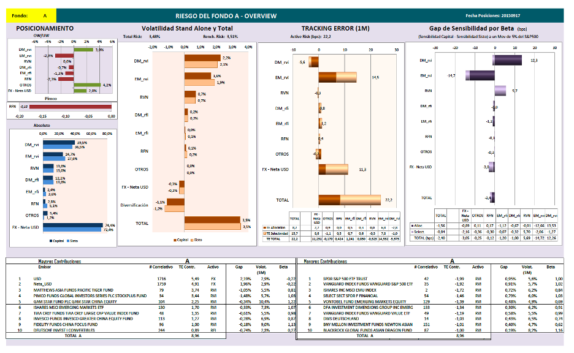

# Spot_that_risk

This report shows an x-ray of the fund, including the position, the tracking error, the trqacking error decomposition, the stand alone risk and diversification benefits, and the sensitivity above the benchmark to changes in the S&P500.

## Technology

* Engine in Matlab
* Data coming from Bloomberg API on Excel
* Excel for the display of the calculation on MatLab
* Pdf generated from an export on Excel
---

## Usage

On the overview for a single fund, the following sections are presented:

1) Relative position with respect to the benchmark Overweigh and Underweight

2) Absolute position of each asset class

3) Volatility stand alone of aseet classes, total, and diversification benefit

4) Monthly Tracking Error per asset class, and total

5) Relative sensitivity of each asset class to a +5% move of the S&P500 with respect to the bnenchmark

6) Securities that generated the top 10 major and minor contributions to the Traking Error

Then, for each asset class, a similar analysis is made over the subasset classes, as can be seen in the picture below.

---
## Contributors
This project was coded by Paola Carvajal Almeida, paola.antonieta@gmail.com.

Contact email: paola.antonieta@gmail.com
LinkedIn profile: https://www.linkedin.com/in/paolacarvajal/

___
## License
This project uses a MIT license. This license allows you to use the licensed material at your discretion, as long as the original copyright and license are included in your work files. This license does not contain a patent grant,  and liberate the authors of any liability from the use of this code.