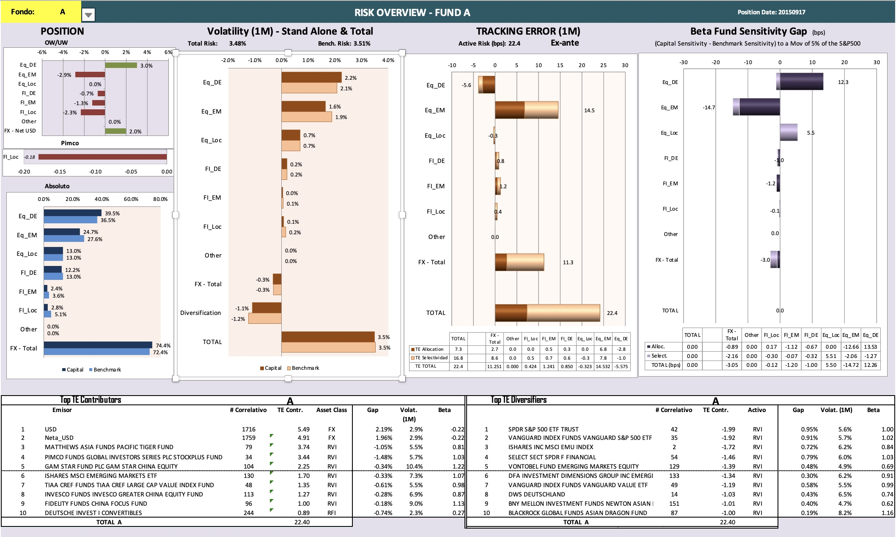
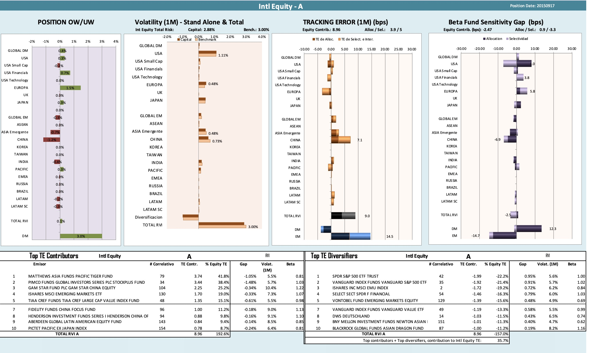
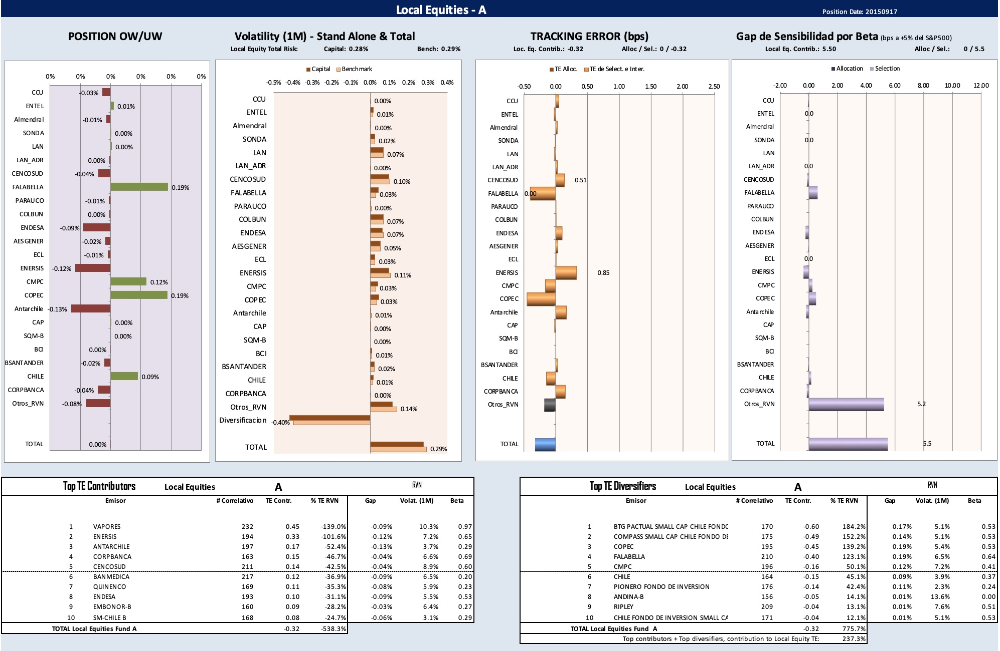

# Spot_that_risk

Here you will find investment management reports that I have constructed using Matlab and Excel.

The report includes the portfolio position, active risk attribution, and beta sensitivity. The report shows an x-ray of the portfolio by asset classes and sub-asset classes.

Specifically:

1) Position (relative and absolute), 

2) Active risk: Tracking error (allocation and selection effect), 
 
3) Absolute Risk: stand alone risk, diversification benefits, 

4) Beta sensitivity above the benchmark 

5) List of key holdings that generate the larger risk contributions and the larger diversification benefits

## Technology

* Engine calculator was made in `Matlab`. As of now comments are in Spanish, but it will be translated into English soon
* Data sources are `Bloomberg API`, together with `SQL databases` for local securities
* `Excel`is used for the graphs and general display of Matlab calculations
* `Èxcel`is used to generate the pdf file report as an export
---

## Usage

Below you will see images of the report. The first one is of the Overview, and the other are some of the asset classes. Specifications are available after the images of the report.

Then, for each asset class, a similar analysis is made over the subasset classes, as can be seen in the pictures below.

Obs: Originally the report was generated in spanish, so a version in spanish is also added in the folder.

Asset classes in Spanish are:

> RVI: Intl equity (Renta Variable Internacional)

> RVN: Local Equity (Renta Variable Nacional)

> RFI: Intl Fixed Income (Renta Fija Internacional)

> RFN: Local Fixed INcome (Renta Fija Nacional)

The following are more specifics of each section:

1) **Position OW/UW:** Relative position with respect to the benchmark (Overweight and Underweight)

2) **Absolute position** of each asset class in the portfolio

3) **Volatility (1-month):**

>3.1) Stand alone of each asset (sub-asset) class; 

>3.2) Total risk and Benchmark risk, which are the portfolio and benchmark total volatility;
    
>3.3) Diversification benefit (which is the difference between the aggregation of all volatilities minus the portfolio total volatility)

4) **Monthly ex-ante tracking error** contribution per asset class, and total tracking error of the portfolio against its benchmark. The grpah shows with different colors the decomposition per allocation and selection effects.

5) **Beta Fund Sensitivity Gap:** shows the relative sensitivity of each asset (or sub asset) class to a +5% move of the S&P500, above the bennchmark.

6) In the tables below are listed:

>6.1) **Top Tracking Error Contributors:** Securities that generated the top 10 major contributions to the Traking Error of the Fund (Overview), or asset class (in the asset class view)
    
>6.2) **Top 10 Trackin Error Diversifiers:** Securities that generated the top 10 major contributions to diversification, and so decreasing the Traking Error, of the fund 8overview), or in the asset class (asset class view)

---
## Contributors
This project was coded by Paola Carvajal Almeida, paola.antonieta@gmail.com.

Contact email: paola.antonieta@gmail.com
LinkedIn profile: https://www.linkedin.com/in/paolacarvajal/

___
## License
This project uses a MIT license. This license allows you to use the licensed material at your discretion, as long as the original copyright and license are included in your work files. This license does not contain a patent grant,  and liberate the authors of any liability from the use of this code.
